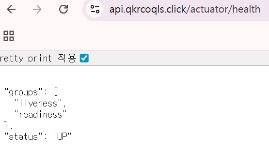
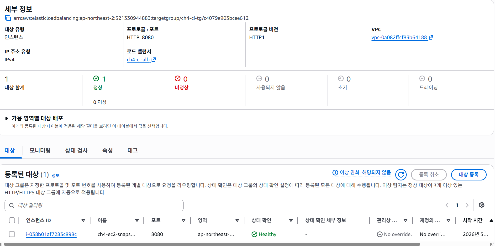

## 예산설정

## EC2 퍼블릭 IP
3.39.254.109

## Actuator Info 엔드포인트 URL
http://3.39.254.109:8080/actuator/info

## RDS 보안 그룹 스크린샷

## Presigned URL

## Github Actions 성공 이미지

## EC2 터미널 이미지

## HTTPS 적용된 도메인 URL
https://api.qkrcoqls.click/actuator/health

## Target Group(대상 그룹) 이미지
